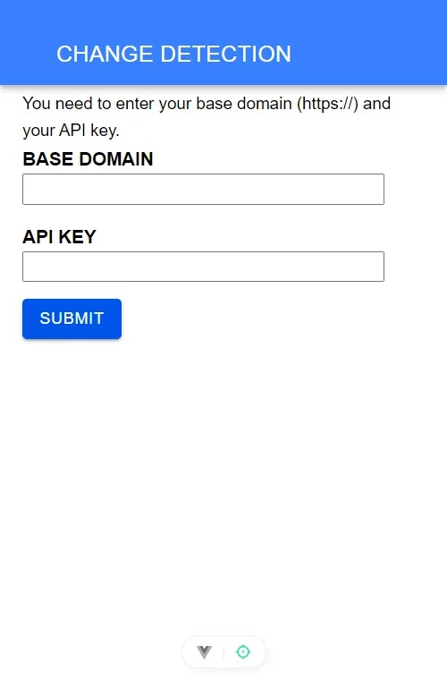
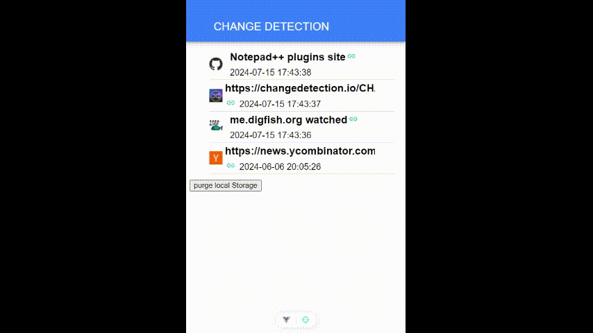

# Change Detection GUI for Android (Preview)

This is a simple, preview, read-only version of an essay for a GUI for android of [ChangeDetection API](https://changedetection.io/docs/api_v1/index.html),  to get all your monitored websites and show the snapshots.

It was made through the Ionic Framework which use reactive frameworks like [vue.js](https://vuejs.org) for the frontend and javascript behind the scenes to communicate with the API. It is basically a webview-based app.

In the first screen you'll be prompted to input the base domain of your changedetection.io installation and its API key. **Rest assured that these values never leave your android device**, since they are stored locally, in the localStorage of the inbuilt webview app.

It's a read-only app, it only reads your data and presents it on the screen, allows you to view each screenshot of the your watched links, and some details, nothing beyond that.

## Download 
[Link for download on Google Drive](d:\Downloads\changedetection-ionic-app-screencast.webm)



# Building

Below are the usual instruction to build an Ionic App based on Vue.JS. For now, i haven't tried a iOs build, neither a PWA one.


## Recommended IDE Setup

[VSCode](https://code.visualstudio.com/) + [Volar](https://marketplace.visualstudio.com/items?itemName=Vue.volar) (and disable Vetur).

## Customize configuration

See [Vite Configuration Reference](https://vitejs.dev/config/).

## Project Setup

```sh
npm install
```

### Compile and Hot-Reload for Development

```sh
npm run dev
```

### Compile and Minify for Production

```sh
npm run build
```

### Lint with [ESLint](https://eslint.org/)

```sh
npm run lint
```
